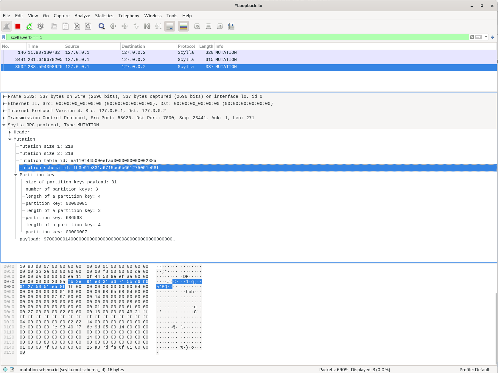

Scylla dissector plugin for wireshark
-------------------

# Compilation

## Clone and checkout compatible wireshark version

Wireshark plugins are compiled as `.so` libraries, so they need to be built with a proper version of wireshark. Current branch is based on `wireshark 3.2.0`, but this commit is quite portable, so feel free to cherry-pick in on top of any branch you need, e.g.:

```bash
$ git tag | grep wireshark-3.2
wireshark-3.2.0
wireshark-3.2.1

$ git checkout wireshark-3.2.1
$ git cherry-pick MY_COMMIT

```

## Build

This repository contains the whole source code of wireshark, but we're interested in plugins only. This command will build only plugins and will not require Qt5 packages:

```bash
mkdir build
cd build
cmake .. -DCMAKE_BUILD_TYPE=Release -DBUILD_WIRESHARK=no
make -j16
```

## Install

In order to install a plugin, it should be put in the appropriate directory. In wireshark, take a look at `Help > About Wireshark > Folders` if you're not sure where to put the plugin. The default (for 3.2.0) should be:

```bash
cp build/run/plugins/3.2/epan/scylla.so ~/.local/lib/wireshark/plugins/3.2/epan/
```

## Configure

To make sure that Scylla is properly loaded, make sure that it's visible in `Preferences > Protocols > Scylla`. You can also specify a different RPC port in there.

Scylla RPC port has a clash with existing Gryphon plugin on TCP port 7000. In order to make sure that Scylla is recognized, try two things:
1. Disable Gryphon: `Analyze > Enabled Protocols > Gryphon > disable`
2. Force dissecting Scylla on port 7000:  `Analyze > Decode As`, set up Scylla protocol for port 7000.

You can also configure `Decode As` via a config file: `~/.config/wireshark/decode_as_entries`:

```yaml
decode_as_entry: tcp.port,7000,Scylla,Scylla
```

## Use

Scylla RPC is not fully dissected yet, but RPC headers are. Mutation dissecting is also partially implemented. Note that RPC negotiation frames are not implemented yet, so they'll appear as weird bogus unknown messages. They're expected to be present only for new connections though.

Examples of working wireshark filters:

* `scylla`: all packets recognized as Scylla RPC
* `scylla.verb == 1`: all packets with `MUTATION` type
* `scylla.mut.table_id == ea:11:0f:44:50:9e:ef:aa:00:00:00:00:00:00:23:8a and scylla.mut.pkey == 68:65:68`: mutations with specific table id and key
* `scylla and not (scylla.verb == 6 or scylla.verb == 7 or scylla.verb == 8)`: scylla, but without gossip spamming every second

## Cool pic



General Information
-------------------

Wireshark is a network traffic analyzer, or "sniffer", for Linux, macOS,
\*BSD and other Unix and Unix-like operating systems and for Windows.
It uses Qt, a graphical user interface library, and libpcap and npcap as
packet capture and filtering libraries.

The Wireshark distribution also comes with TShark, which is a
line-oriented sniffer (similar to Sun's snoop or tcpdump) that uses the
same dissection, capture-file reading and writing, and packet filtering
code as Wireshark, and with editcap, which is a program to read capture
files and write the packets from that capture file, possibly in a
different capture file format, and with some packets possibly removed
from the capture.

The official home of Wireshark is https://www.wireshark.org.

The latest distribution can be found in the subdirectory https://www.wireshark.org/download
